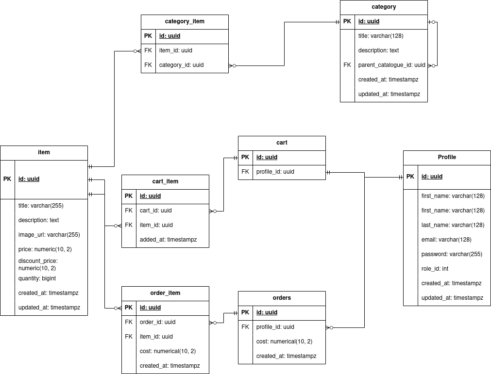

# Интернет-магазин (Серверная часть)
### Для запуска должен быть предустановлен `docker-compose`, `docker`:
### Пример запуска:
`
    docker-compose up -d`
либо
`    docker compose up -d
`


### Для альтернативного способа запуска потребуется `maven` и `java` от 8 версии
### Также потребуется `postgresql` версии 16 с настроенным пользователем shop, паролем shop и  базой данных shop
#### (Данные настройки можно изменить в application-dev.yaml)
### Пример запуска:
```
    mvn package
    cd target
    java -jar -DSPRING_PROFILES_ACTIVE=dev shop-1.0.jar 
```

### Для запуска в OpenIDE/IntelliJ должен быть запущен `postgresql` версии 16 (см. выше), также можно запустить контейнер с бд из docker compose
#### Пример: 
`docker-compose up -d shop-db` либо `docker compose up -d shop-db`

### Открыть проект в одном из редакторов, найти класс Main.java, запустить с помощью соответствующего треугольника

# ER-диаграмма 
